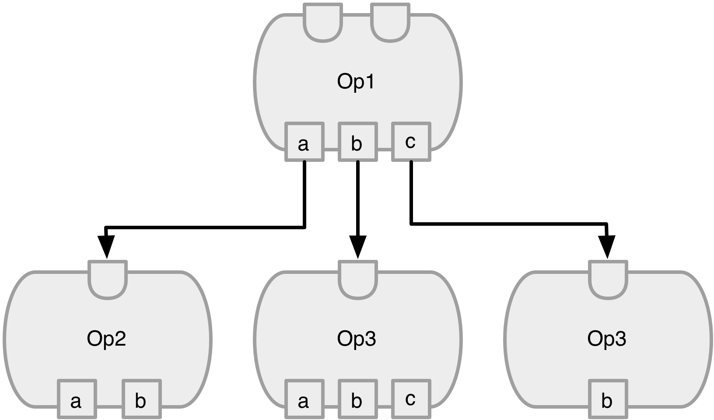

Neural Network library
======================

Overview
--------
The basic building block is an ``Op``, which is parameterized by the underyling storage type (see the ``Tensor`` documentation for more details). Every ``Op`` as the function ``apply``, which performs a transform on the ``Op`` s input updating the `output` variable. ``Op`` s may have a variable number of inputs and outputs.

  **Figure 1**: A computation graph is formed by connecting multiple ``Op`` s together. The inputs are a collection of ``Op`` s, and the outputs, the result of the operation applied to the input, are a collection of ``Tensor`` s.

The design of the ``Op`` class is keep the details of how the optimization is performed separate from the transform itself. For example, the protocol ``Differentiable`` provides a method to extend the ``Op`` class with the ``gradient`` method for stochastic gradient descent optimization. The ``gradient`` methods returns a new ``Op`` whose transform is the derivative of the target ``Op``. This allows a secondary computation graph to easily be constructed:

.. code:: swift

  let linear = Linear<D>(inputSize: 5, outputSize: 3)
  let linearGrad = linear.gradient()

Some ``Op`` s, like ``Sequence`` are collections of other ``Op`` s, and will invoke (via ``apply``) each of the contained ``Op`` s in a pre-determined order. For example, a standard neural network can be created with:

.. code:: swift

  let net = Sequence<D>(
    Variable<D>(zeros(Extent(5))),
    Linear<D>(inputSize: 5, outputSize: 3),
    Sigmoid<D>(size: 3),
    L2Loss<D>(size: 3))

  net.apply()

There are a few important items of note in this example:

1. The ``apply`` method takes no parameters and has no return value
2. The input to the first layer of the network is of the type ``Variable``, which is also an ``Op``
3. The loss function ``L2Loss`` is also an ``Op``

The design decision to make everything an ``Op`` allows the creation of the computational graph. In this case, all of the ``Op`` s are also ``Differentiable``, and thus you can do:

.. code:: swift

  let netGrad = net.gradient()

Optimization can be performed with the following code:

.. code:: swift

  params = net.params()
  gradParams = netGrad.params()

  for i in 0..<iterations {
    netGrad.reset()

    net.apply()
    netGrad.apply()

    for (param, gradParam) in Zip2Sequences(params, gradParams) {
      param += 0.01*gradParam
    }
  }

However, this code can be simplified using an ``Optimizer``:

.. code::

  let alpha = Variable<D>(0.01)
  let opt = GradientDescentOptimizer(net, alpha: alpha)

  for i in 0..<iterations {
    opt.apply()
  }

where ``GradientDescentOptimizer`` automatically constructs the gradient network and collects the parmaeters for both the forward and backward sequences.

One of the advantages to having everything be an operation in the computation graph is that the ``alpha`` variable can be set dynamically. For example, if a momentum optimization is desired, the ``alpha`` variable can be computed from the current error.

The Op class
----------------
The ``Op`` class has the following properties:

* id: unique ID for instance of ``Op``
* inputs: collection of ``Op`` s
* output: collection ``Tensor`` s that are a result of the transform

and has the following methods defined:

* apply(): performs transform on inputs and stores results in ``output``
* params(): returns all the parameters of the transform (e.g. if its a ``Linear`` Op, then the parameters are ``weight`` and ``bias``).

-----------------
OrderedDictionary
-----------------

One important detail about the ``inputs`` and ``outputs`` of an ``Op`` is that it
is maintained by the ``OrderedDictionary`` class. An instance of the ``OrderedDictionary``
class maintains a dictionary of (``String``: [``T``]), but also provides a method to
traverse the items in the order that they were added. This provides a guarantee in
the order of traversal as well as provide a method for efficient access (e.g. if
an ``Op`` has a specific ordering of ``inputs``, an integer index may be used instead
of a ``String``).

By maintaining an array of ``T`` means that a single entry in the ``OrderedDictionary``
may be a collection of items. This provides an easy way to create ``Op`` s that
have a variable number of inputs and/or outputs. For example, the ``AddOp``
can take in ``N`` inputs and will provide a single output.

----------
Op library
----------
.. function:: Linear

  Performs a linear transformation on input.

.. function:: Sigmoid

  Applies the sigmoid function to each element of the input.

.. function:: Tanh

  Applies the Tanh function to each element of the input

.. function:: AddOp

  Adds a collection of inputs together

.. function:: MulOp

  Multiplies a collection of inputs together

.. function:: Concat

  Concatenates a series of inputs together

.. function:: L2Loss

  Takes two inputs: ``value`` and ``target``. Calculates the square distance between the two.

-----------------
Creating a new Op
-----------------
Suppose you wanted to create an ``Op`` that takes the log of the input. The ``Log`` op can be defined as:

.. code:: swift

  public class Log<S:Storage where S.ElementType:FloatNumericType>: Op<S> {
    public init(size:Int) {
      super.init( inputs: [NoOp<S>()],
                  output: Tensor<S>(Extent(size)),
                  labels: ["input"])
    }

    public override func apply() {
      if output == nil || output!.shape != inputs[0].output!.shape {
        output = Tensor<S>(Extent(inputs[0].output!.shape))
      }

      log(inputs[0].output!, result: output!)
    }
  }

where the initialization defines a single input (``input``) that is currently not defined (the ``NoOp``) and the output is allocated as the size specified by the parameter. The ``apply`` function finds the maximum value in the input, divides each element of the input by that value, and stores in the result in ``output``.

The gradient of ``Log`` can be defined as:

.. code::Swift

  public class LogGrad<S:Storage where S.ElementType:FloatNumericType>: Op<S>, Gradient {
    public required init(op:Log<S>) {
      super.init( inputs: [op, op.inputs[0], NoOp<S>()],
                  output: Tensor<S>(op.output!.shape),
                  labels: ["op", "input", "gradOutput"])
    }

    public override func apply() {
      fill(output!, value: 1)
      output! /= inputs[1].output!
      output! *= inputs[2].output!
    }

    public func reset() {
      fill(output!, value: 0)
    }
  }

The ``Log`` gradient takes two additional inputs: the instance of the ``Log`` op its the gradient of, and ``gradOutput``, which is the gradient of the op's output.

Finally, to allow the gradient to be taken of ``Log``, the class must be extended to ``Differentiable``:

.. code:: swift

  extension Log:Differentiable {
    public func gradient() -> GradientType {
      return LogGrad<S>(op: self)
    }
  }

We can change the construction of our network by adding ``Log`` into the sequence:

.. code:: swift

  let net = Sequence<D>(
    Variable<D>(zeros(Extent(5))),
    Log<D>(size: 5)
    Linear<D>(inputSize: 5, outputSize: 3),
    Sigmoid<D>(size: 3),
    L2Loss<D>(size: 3))

and have the optimization correctly calculate the derivative as before:

.. code:: swift

  let opt = GradientDescentOptimizer(net, alpha: alpha)

because ``GradientDescentOptimizer`` will automatically call ``gradient`` on each ``Op``, an instance of ``LogGradient`` will be created for each instance of ``Log``.

-----------------
Testing your Op
-----------------
It is always a good idea to do a gradient check on a newly created ``Op``. You can create a new unit test to do so:

.. code:: swift

  func testLogOpGradient() {
    let eps = 10e-6
    let input = Variable<S>(uniform(Extent(10)))
    let gradOutput = Variable<S>(zeros(Extent(10)))

    let log = Log<S>(size: 10)
    log.setInput("input", to: input)

    let logGrad = log.gradient() as! LogGrad<S>
    logGrad.setInput("gradOutput", to: gradOutput)

    // test gradient wrt to the input
    let inputError = checkGradient(log, grad: logGrad, params: input.output, gradParams: logGrad.output, eps: eps)
    XCTAssertLessThan(inputError, eps)
  }
